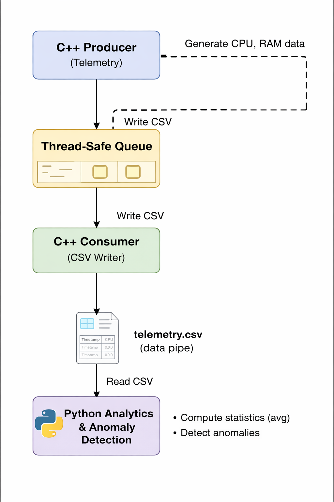

# Real-Time Telemetry Ingestion & Analytics Pipeline

A real-world inspired project that demonstrates how C++ and Python work together in a continuous, real-time data pipeline.
The system simulates telemetry data, ingests it using a multi-threaded C++ service, and performs live analytics and anomaly detection using Python.

This project focuses on system behaviour, concurrency, and data flow, not heavy algorithms.

## Project Overview:

### Why This Project Exists?

Most beginner projects:

• run once and exit

• print values and stop

• don’t reflect how real software behaves

Real systems are different. They:

• run continuously

• collect data over time

• separate data generation from analysis

• remain stable for long durations

This project was built to understand how real monitoring and analytics systems actually work at a foundational level.

### High-Level System Overview

The system is split into two independent layers:

1. C++ Telemetry Engine (Producer System)

• Runs continuously as a background service

• Generates synthetic system metrics (CPU, RAM)

• Uses multi-threading to separate responsibilities

• Writes telemetry data to a persistent CSV file

2. Python Analytics Engine (Consumer System)

• Runs independently from C++

• Reads telemetry data from the CSV file

• Computes live statistics

• Detects anomalies using rule-based logic

The two layers are loosely coupled and communicate through a file-based data pipe.

## System Architecture

### Architecture Flow (What Is Happening Internally)

1. A C++ Producer thread generates telemetry samples at fixed intervals

2. Samples are pushed into a thread-safe queue

3. A C++ Consumer thread reads from the queue and writes structured data to telemetry.csv

4. A Python process periodically reads the CSV file

5. Python computes analytics and flags abnormal behaviour

This separation ensures:

• ingestion is never blocked by analysis

• analytics can be modified without touching C++

• the system remains stable and extensible

### C++ Telemetry Engine (Detailed)

Core Responsibilities

• Continuous execution

• Data generation

• Thread coordination

• Safe memory access

• Persistent logging

Key Design Choices
Producer–Consumer Pattern

• Producer thread generates data

• Consumer thread handles output

• Queue decouples generation from I/O

### Thread Safety

• std::mutex protects shared memory

• std::condition_variable avoids busy waiting

### Why CSV?

• Simple, transparent data format

• Easy to debug

• Language-agnostic

• Common in real telemetry pipelines

### Data Model (Per Sample)

Field
                                 Description
timestamp
                                 Time of sample creation (ms)
cpu
                                 Simulated CPU usage (%)
ram
                                 Simulated RAM usage (%)

### Python Analytics Layer (Detailed)

Core Responsibilities

• Read live telemetry data

• Handle imperfect data safely

• Compute statistics

• Detect anomalies

### Analytics Performed

• Total sample count

• Average CPU usage

• Average RAM usage

• Latest-sample anomaly detection

### Anomaly Detection Logic

The system flags anomalies when:

• CPU usage exceeds 80%

• RAM usage exceeds 80%

This mimics how real monitoring systems begin with rule-based intelligence before introducing ML models.

### Robustness Features

• Handles duplicate CSV headers

• Skips corrupted or partial rows

• Works without external dependencies

• Resistant to partial file writes

How the System Behaves at Runtime

• The C++ engine runs quietly in the background

• telemetry.csv grows continuously

• Python reads the same file without interfering

• Analytics update periodically

• Anomalies are detected in near real-time

The system can run indefinitely without crashing or blocking.

